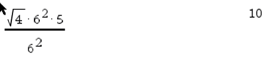

10パズル(Scala)
=========
　1桁の数字4つを使って計算結果を10にするパズルを解きます。

　1111〜9999までを総当たりで計算します。    
　四則演算のみだと(順序が違うだけの式も1パターンと数えてしまっていますが)、5137パターンあります。平方根と自乗も演算子として使えるようにすると、174111パターンです。

例)    
表示結果    
-------
```
List(2, 6, 5, 6), ms = (((sqrt(4) * square(6)) * 5) / square(6)), n = 10
```

検算    
----


補足
----
　oneArgFuncsに使用できる1項演算子、twoArgsFuncsに2項演算子を追加すると、計算に使用する演算子を増やすことができます。